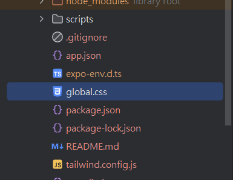
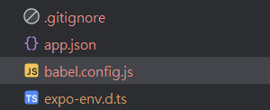

### **Style Sheet VS NativeWind 的實際應用**

假設你要實現一個簡單的按鈕：

style sheet:

```javascript
import React from 'react';
import { Text, TouchableOpacity, StyleSheet } from 'react-native';

const Button = () => {
  return (
    <TouchableOpacity style={styles.button}>
      <Text style={styles.text}>Click Me</Text>
    </TouchableOpacity>
  );
};

const styles = StyleSheet.create({
  button: {
    backgroundColor: '#3b82f6', // Tailwind 的 bg-blue-500
    padding: 10,               // Tailwind 的 p-4
    borderRadius: 5,           // Tailwind 的 rounded
  },
  text: {
    color: 'white',            // Tailwind 的 text-white
    textAlign: 'center',       // Tailwind 的 text-center
  },
});

export default Button;

```

使用 NativeWind:

```javascript
import React from 'react';
import { Text, TouchableOpacity } from 'react-native';
import { styled } from 'nativewind';

const StyledButton = styled(TouchableOpacity);
const StyledText = styled(Text);

const Button = () => {
  return (
    <StyledButton className="bg-blue-500 p-4 rounded">
      <StyledText className="text-white text-center">Click Me</StyledText>
    </StyledButton>
  );
};

export default Button;

```

---

安裝 NativeWind

:

### 1. Install NativeWind

```bash
npx expo install nativewind tailwindcss react-native-reanimated react-native-safe-area-context
```

### 2. Setup Tailwind CSS

```bash
npm install nativewind tailwindcss

```

Run `npx tailwindcss init` to create a `tailwind.config.js` file

Add the paths to all of your component files in your tailwind.config.js file.

```javascript
module.exports = {
  content: ["./app/**/*.{js,jsx,ts,tsx}", "./components/**/*.{js,jsx,ts,tsx}"],
  presets: [require("nativewind/preset")],
  theme: {
    extend: {},
  },
  plugins: [],
};

```

Create a CSS file and add the Tailwind directives

global.css:

```css
@tailwind base;
@tailwind components;
@tailwind utilities;
```



---

### 3. Add the Babel preset

```javascript
//babel.config.js:

module.exports = function (api) {
    api.cache(true);
    return {
        presets: [
            ["babel-preset-expo", { jsxImportSource: "nativewind" }],
            "nativewind/babel",
        ],
        plugins: [
            "expo-router/babel",
            "react-native-reanimated/plugin",
        ],
    };
};

```



### 4.更改 tailwind.config.js

```javascript
//tailwind.config.js
module.exports = {
  content: ["./app/**/*.{js,jsx,ts,tsx}", "./components/**/*.{js,jsx,ts,tsx}"],
  presets: [require("nativewind/preset")],
  theme: {
    extend: {},
  },
  plugins: [],
};

```

### 4. Modify your metro.config.js

```bash
npx expo customize metro.config.js
```

```bash
npm list tailwindcss

```

```bash
npm install -D tailwindcss

```

```bash
npm install -g npm@latest

```

```bash
npm install -g expo-cli

```

```javascript
const { getDefaultConfig } = require("expo/metro-config");
const { withNativeWind } = require("nativewind/metro");

const config = getDefaultConfig(__dirname, { isCSSEnabled: true });

module.exports = withNativeWind(config, { input: "./global.css" });
```

由於過程版本繁瑣 有必要時會需要一直重新安裝expo 很麻煩 請參考 主目錄是否長這樣


