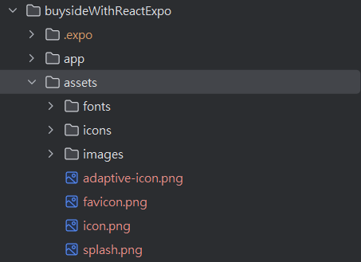
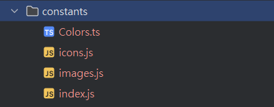

https://github.com/adrianhajdin/aora   <-----------------從這邊下載

tailwind.config.js 可以置入別人做好的主題

```javascript
module.exports = {
  content: ["./app/**/*.{js,jsx,ts,tsx}", "./components/**/*.{js,jsx,ts,tsx}"],
  presets: [require("nativewind/preset")],
  theme: {    //<-----------------這邊可以置入別人做好的主題
    extend: {},
  },
  plugins: [],
};

```

以及把自己的 asset 換成下載有裝字型的asset



constants 也從下載的目錄複製過去一分到自己的



# `constants` 資料夾的用途

在前端或 React Native 開發中，`constants` 資料夾通常用來儲存專案中會被多處使用的「固定不變」或「通用」的變數或設定，這樣可以讓程式碼更容易管理和維護。

---

## 檔案用途說明

### 1. **`Colors.ts`**

* **用途**：定義應用程式中使用的顏色常數，幫助開發者在整個專案中保持顏色一致性。
* **範例內容**：
  ```typescript
  const Colors = {
      primary: '#3498db',
      secondary: '#2ecc71',
      danger: '#e74c3c',
      white: '#ffffff',
      black: '#000000',
      gray: '#7f8c8d',
  };

  export default Colors;
  ```

---

### 2. **`icons.js`**

* **用途**：集中管理應用程式中使用的圖標（icon）路徑或組件，方便切換圖標套件或更新路徑。
* **範例內容**：
  ```javascript
  const icons = {
      home: require('../assets/icons/home.png'),
      search: require('../assets/icons/search.png'),
      user: require('../assets/icons/user.png'),
  };

  export default icons;
  ```

---

### 3. **`images.js`**

* **用途**：專門用於管理應用中用到的圖片資源。
* **範例內容**：
  ```javascript
  const images = {
      logo: require('../assets/images/logo.png'),
      background: require('../assets/images/background.jpg'),
      profile: require('../assets/images/profile.png'),
  };

  export default images;
  ```

---

### 4. **`index.js`**

* **用途**：作為 `constants` 資料夾的入口檔案，用於統一匯出其他檔案的內容。
* **範例內容**：
  ```javascript
  import Colors from './Colors';
  import icons from './icons';
  import images from './images';

  export { Colors, icons, images };
  ```
* **匯入範例**： 在其他檔案中，只需引入 `constants/index.js`，即可使用所有的常數：
  ```javascript
  import { Colors, icons, images } from '../constants';
  ```

---

## 使用 `constants` 資料夾的好處

1. **集中管理**：所有常用的變數（如顏色、圖標、圖片）都集中在一個地方，方便管理和修改。
2. **減少重複**：避免在多個檔案中重複定義相同的資源或設定。
3. **提高可維護性**：當設計或需求改變時，只需要修改常數檔案，而不用在程式碼中四處搜尋。

---

如果這些檔案尚未被充分利用，可以按照上述方式整理和優化，讓專案結構更清晰且維護更方便！
