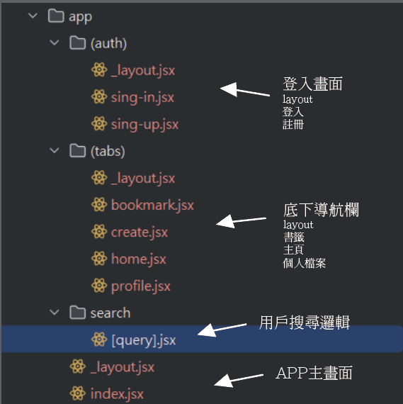

## 新增多個頁面



所有頁面先新增rnfes  如:

```javascript
import React from 'react';
import {View, Text, StyleSheet} from 'react-native';

const Search = () => {
    return (
        <View style={styles.container}>
            <Text>Search</Text>
        </View>
    );
};

const styles = StyleSheet.create({
    container: {
        flex: 1,
        justifyContent: 'center',
        alignItems: 'center',
    },
});

export default Search;

```
