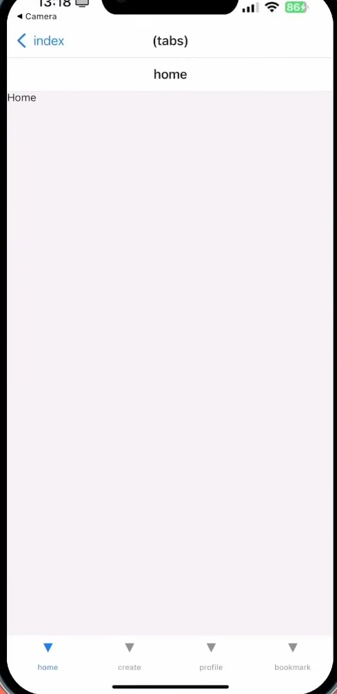

### 1.到 app/index.jsx 把Link 的 href 改成 "/home"

這樣就可以從 index 主畫面點選 跳到tabs layout

```javascript
import {StatusBar} from 'expo-status-bar';
import {Text,View} from 'react-native';
import{Link} from 'expo-router';

export default function App(){
    return (
        <View className='flex-1 items-center justify-center bg-amber-600'>
            <Text className = "text-3xl font-extrabold items-center justify-center ">well come to buyside!</Text>
            <StatusBar status="auto" />
            <Link href="/home" style={{color:'white'}}>
                click here to home page
            </Link>
        </View>
    );
}

```

### 2.到 (tabs)/_layout.jsx import Tabs 、Redirect

```javascript
import{Tabs,Redirect} from "expo-router";
import {View, Text, StyleSheet} from 'react-native';

const TabsLayout = () => {
    return (
        <>
            <Tabs>
                <Tabs.Screen name="home"></Tabs.Screen>
            </Tabs>
        </>
    );
};


export default TabsLayout;

```

隨後新增 Tabs 標籤 並且在屬性 name = "home"  設定完之後 即可在 expo go 上看見導航欄 且有分別4個選項



在這之前先安裝 expo-image

```bash
npm install expo-image

```


### 3.設定home 的 icon

```javascript
const TabsLayout = () => {
    return (
        <>
            <Tabs
                screenOptions={{
                    tabBarStyle: false,
                }}
            >
                <Tabs.Screen
                    name="home"
                    options={{
                        title: 'Home',
                        headerStyle: false,
                        tabBarIcon: ({ color,focused }) => (
                            <TabIcon
                                icon={icons.home}
                                color={color}
                                name = "Home"
                                focused = {focused}
                            />
                        )
                    }}
                />
            </Tabs>
        </>
    )
};

```


### **完整層級結構**

1. ## **`TabsLayout` (就是導航欄)**


   * 包含 `Tabs` 組件。
2. ## **`Tabs`**


   * 定義多個標籤頁。
3. ## **`Tabs.Screen`**


   * 每個標籤頁的配置，包含路由名稱和外觀選項。
   * 由於有4個頁面所以等等會複製4個Tabs.Sreen
4. ## **`TabIcon`**


   * 自定義圖標和文字的樣式。

   ### TabsLayout

   ```javascript
   <Tabs screenOptions={{ tabBarStyle: false }}>
               {/* Home 鍵 */}
               <Tabs.Screen
                   name="home"
                   options={{
                       title: 'Home',
                       headerStyle: false,
                       tabBarIcon: ({ color, focused }) => (
                           <TabIcon
                               icon={icons.home}
                               color={color}
                               name="Home"
                               focused={focused}
                           />
                       ),
                   }}
               />
    </Tabs>
   ```

   ### TabIcon 設定圖片區

   ```javascript

   const TabIcon = ({ icon, color, name, focused }) => { // 設定導航欄 "圖片" 的地方
       return (
           <View className="items-center justify-center gap-2">
               <Image
                   source={icon}
                   style={{ width: 24, height: 24, resizeMode: 'contain' }}   //<---------!!!!! Image 元件需要明確的 width 和 height，否則圖片無法正常渲染
                   tintColor={color}
                   className="w-6 h-6"
               />
           </View>
       );
   };
   ```

   **`Image`** 元件需要明確的 `width` 和 `height`，否則圖片無法正常渲染

### 5.在 `<Tabs>` 設定導航欄bar 本身的效果

```javascript
<Tabs screenOptions={{
            tabBarShowLabel: false,
            tabBarActiveTintColor: '#FFA001',
            tabBarInactiveTintColor: '#CDCDE0',
            tabBarStyle: {
                backgroundColor: '#161622',
                borderTopWidth: 1,
                borderTopColor: '#232533',
                height: 84,
            }
```


### 1. `tabBarShowLabel: false`

* **功能：** 設定是否顯示標籤頁下方的文字（label）。
* **解釋：** 設定為 `false` 時，會隱藏標籤頁名稱，只顯示圖標。通常用來讓圖標佔據更多的顯示空間，提升UI的整體美觀。

### 2. `tabBarActiveTintColor: '#FFA001'`

* **功能：** 設定當前活動標籤頁（即被選中的標籤頁）圖示的顏色。
* **解釋：**`#FFA001` 是一個橙色的顏色代碼。當用戶選中某個標籤頁時，該標籤頁的圖示會顯示為這個顏色。

### 3. `tabBarInactiveTintColor: '#CDCDE0'`

* **功能：** 設定非活動標籤頁（即未被選中的標籤頁）圖示的顏色。
* **解釋：**`#CDCDE0` 是一個較淺的灰藍色。這個顏色會用於未選中的標籤頁圖示，以讓活動的標籤頁更突出。

### 4. `tabBarStyle: { ... }`

* **功能：** 設定整體導航欄（Tab Bar）的樣式。這裡的樣式用於控制導航欄的背景顏色、邊框、以及高度等外觀屬性。
* **解釋：**
  * `backgroundColor: '#161622'`：設置導航欄的背景顏色為深灰色。
  * `borderTopWidth: 1`：設置導航欄的上邊框寬度為 1 像素，通常用於製造邊界效果。
  * `borderTopColor: '#232533'`：設置上邊框的顏色為比背景顏色稍淺的灰色，增強邊界效果。
  * `height: 84`：設置導航欄的高度為 84 像素，這將影響標籤頁的可視大小。

### 目前(tabs)/_layout.jsx 所有code

```javascript
import { View, Text } from 'react-native';
import { Tabs } from "expo-router";
import { Image } from "expo-image";
import { icons } from '../../constants';


// ----------------------------------- 設定導航欄 "圖片配置" 的地方-----------------------------------
const TabIconConfig = ({ icon, color, name, focused }) => { 
    return (
        <View className="items-center justify-center gap-2">
            <Image
                source={icon}
                style={{ width: 24, height: 24, resizeMode: 'contain' }}
                tintColor={color}
                className="w-6 h-6"
            />
        </View>
    );
};

// ----------------------------------------------導航欄-------------------------------------------------------
const TabsLayout = () => {
    return (
        //--------------------------------------導航欄配置------------------------------
        <Tabs
            screenOptions={{   
                // 是否顯示標籤頁文字，設置為 false 會隱藏文字，只顯示圖標
                tabBarShowLabel: false,
                // 當前活動標籤頁（選中）圖示的顏色
                tabBarActiveTintColor: '#FFA001', // 橙色
                // 非活動標籤頁（未選中）圖示的顏色
                tabBarInactiveTintColor: '#CDCDE0', // 灰藍色
                // 設置整體導航欄的樣式
                tabBarStyle: {
                    // 導航欄的背景顏色設置為深灰色
                    backgroundColor: '#161622',
                    // 設置導航欄的上邊框寬度為 1 像素
                    borderTopWidth: 1,
                    // 設置上邊框的顏色為稍淺的灰色
                    borderTopColor: '#232533',
                    // 設置導航欄的高度為 84 像素
                    height: 84,
                },
            }}
        >
            {/*------------------------------ Home 鍵 ----------------------------------------*/}
            <Tabs.Screen
                name="home"
                options={{
                    title: 'Home',
                    headerStyle: false,
                    tabBarIcon: ({ color, focused }) => (
                        <TabIconConfig
                            icon={icons.home}
                            color={color}
                            name="Home"
                            focused={focused}
                        />
                    ),
                }}
            />
          
            {/*------------------------------ Bookmark 鍵----------------------------------------*/}
   
            <Tabs.Screen
                name="bookmark"
                options={{
                    title: 'Bookmark',
                    headerStyle: false,
                    tabBarIcon: ({ color, focused }) => (
                        <TabIconConfig
                            icon={icons.bookmark}
                            color={color}
                            name="Bookmark"
                            focused={focused}
                        />
                    ),
                }}
            />

            {/*-------------------------------- Create 鍵----------------------------------------*/}
            <Tabs.Screen
                name="create"
                options={{
                    title: 'Create',
                    headerStyle: false,
                    tabBarIcon: ({ color, focused }) => (
                        <TabIconConfig
                            icon={icons.plus}
                            color={color}
                            name="Create"
                            focused={focused}
                        />
                    ),
                }}
            />

            {/*-------------------------------- Profile 鍵----------------------------------------*/}
            <Tabs.Screen
                name="profile"
                options={{
                    title: 'Profile',
                    headerStyle: false,
                    tabBarIcon: ({ color, focused }) => (
                        <TabIconConfig
                            icon={icons.profile}
                            color={color}
                            name="Profile"
                            focused={focused}
                        />
                    ),
                }}
            />
        </Tabs>
    );
};

export default TabsLayout;

```
