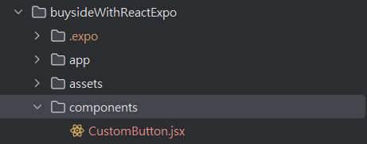

## 在主目錄下 新增 component

並且在裡面新增CustomButton.jsx


//CustomButton.jsx  (用 TouchableOpacity 做按鈕)

```javascript
import React from 'react';
import {TouchableOpacity,Text} from 'react-native';

const CustomButton = () => {
    return (
        <TouchableOpacity calssName={`bg-300`}>
            <Text>Custom Button</Text>
        </TouchableOpacity>
    );
};


export default CustomButton;

```
