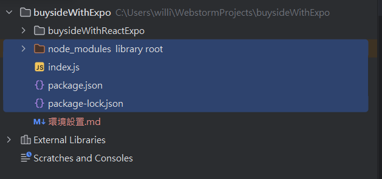
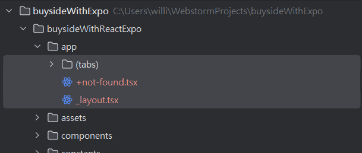
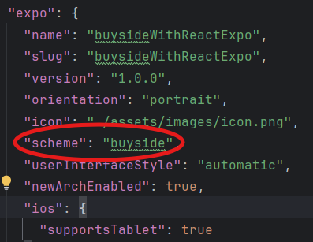
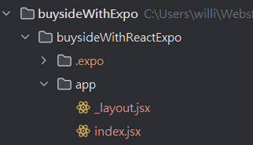

[Install Expo Router - Expo Documentation](https://docs.expo.dev/router/installation/)

1.先執行 npx create-expo-app

```bash
npx create-expo-app@latest
```

2.安裝大補帖

```bash
npx expo install expo-router react-native-safe-area-context react-native-screens expo-linking expo-constants expo-status-bar
```

```lua
my-project/
├── app/              <-- 这是新的入口目录
│   └── index.js      <-- 应用的默认入口文件
├── package.json
├── babel.config.js
├── metro.config.js
├── node_modules/
└── ...

```

* **`app/index.js`**：这是新项目的主入口文件，取代了以前的 `App.js`。
* **`expo-router`**：新版的默认模板可能会自动集成 `expo-router`，这是一个基于文件系统的路由框架，可以简化导航功能。

在项目根目录下，新建一个 `_layout.jsx` 文件，填入以下代码：

```javascript
import React from 'react';
import { View, Text, StyleSheet } from 'react-native';

export default function App() {
    return (
        <View style={styles.container}>
            <Text>Welcome to my Expo app!</Text>
        </View>
    );
}

const styles = StyleSheet.create({
    container: {
        flex: 1,
        justifyContent: 'center',
        alignItems: 'center',
    },
});

```

刪除沒有必要的文件 只保留剛剛 expo新增的目錄


app資料夾也清空 並且將_layout.jsx新增並放來這裡 (他將當作程式入口)


更改 scheme名稱 (app名稱)


現在就可以 運行 npx expo start -c

再將_layout.jsx 的程式碼複製到 新創的檔案 index.jsx 也把它放到 app 資料夾



index 會是我們的 home_page 以術語來說會是 forward SL route

_layout 與 index 的配合


# `_layout.jsx` 與 `index.jsx` 的作用與配合方式

## `_layout.jsx` 的作用：

- **定義頁面的外部結構和通用樣式**。
- 類似於一個框架，把所有子頁面的內容包裹起來。
- 包含固定的部分，比如：
  - 導航欄
  - 頁眉
  - 頁腳

---

## `index.jsx` 的作用：

- **定義頁面的具體內容**。
- 只負責顯示當前頁面的信息，例如：
  - 文字
  - 圖片
  - 按鈕

---

## 兩者如何配合：

1. **`_layout.jsx` 是父組件**：
   - 負責統一的佈局和通用內容。
2. **`index.jsx` 是子組件**：
   - 負責每個頁面的具體內容。
3. 子頁面的內容會插入到 `_layout.jsx` 的 `{children}` 區域。
   - 當訪問 `/` 時，`index.jsx` 的內容會被渲染到 `_layout.jsx` 的 `{children}` 區域內。

---

## 使用範例：

### `_layout.jsx`

```jsx
import { View, Text } from 'react-native';

export default function Layout({ children }) {
  return (
    <View style={{ flex: 1, padding: 20, backgroundColor: '#f8f9fa' }}>
      {/* 頁眉 */}
      <View style={{ padding: 10, backgroundColor: '#007bff' }}>
        <Text style={{ color: 'white', fontSize: 18 }}>我的應用程式</Text>
      </View>

      {/* 子頁面內容 */}
      {children}

      {/* 頁腳 */}
      <View style={{ padding: 10, backgroundColor: '#343a40' }}>
        <Text style={{ color: 'white', fontSize: 14 }}>底部導航</Text>
      </View>
    </View>
  );
}
```
